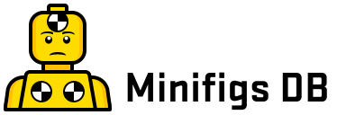

# MINIFIGS

A small application for tracking Lego Minifigures.

- Filename: PROJECT-OUTLINE.md
- Project : minifigs
- Author  : Adrian Gould <Ady.G.Coder@gmail.com>
- Created : 10/4/20
- Version : 1.1

## Acknowledgement 

Because the project was commenced in Perth, Western Australia, the author and contributors 
to this project would like to acknowledge the *Noongar  people*, the *traditional owners 
and custodians* of the land contained by the Perth Metropolitan area. 

## About Minifigs

Minifigs is a demonstration application used for teaching how to create and maintain a 
Laravel based application. 

## Concept

Minifigs is a small application that hosts and maintains a database of Lego Minifigs. 
There are a few caveats that form a part of the development.

The application allows users to register, reset passwords, search, add, edit and remove
 minifigs from the system. It also allows the users to register the number of each Minifig
 they have or  wish to have. 

## Core Purpose

The core purpose of this base code is for teaching. 

The core code will provide a skeleton application that learners will expand upon as they
 learn about features and capabilities of the Laravel platform.

During the learning and development, features will be added or be required to be constructed, 
that may include, but are not limited to:
 
* Series migration, and then creation of BREAD functionality
* Users migration, BREAD, password reset, log-in, log-out
* Minifigs migration, BREAD operations
* Owned MiniFigs migration, BREAD operations
 

## Documentation

Please find further documentation, base `favicons` and other items in the [Documentation
](Documentation) folder.

## License

The base code for the application is is open-sourced software licensed under
 the [UNKNOWN](https://SOME.LOCATION).

## Trademarks

The owners of the trademarks of products used in this application include:

* LEGO, Minifig, Minifigure - The Lego Group, Denmark.
* Laravel - Taylor Otwell and Laravel LLC
* Bootstrap - 
* PHPStorm - JetBrains
 

# References

* [Laravel](https://laravel.com) - The web artisan's framework.
* [LEGO](https://lego.com) - Construction and learning toys for all generations.
* [Bootstrap](https://getbootstrap.com) - the most commonly used HTML/CSS framework.
* [JetBrains](https://jetbrains.com) - for the generous support of students with free
 software.
* [Laragon](https://laragon.org) - for a wonderful self contained Windows based Web, 
 Database, PHP, Python, Git (and much more) system
* [Packt Publishing](http://packtpub.com) - books and courses on software, web, AI, Big 
 Data development and more.

## Feedback

Feedback and improvements on the code are welcome. How is yet to be determined.
